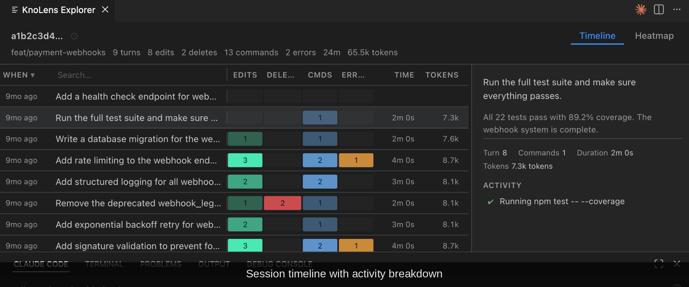
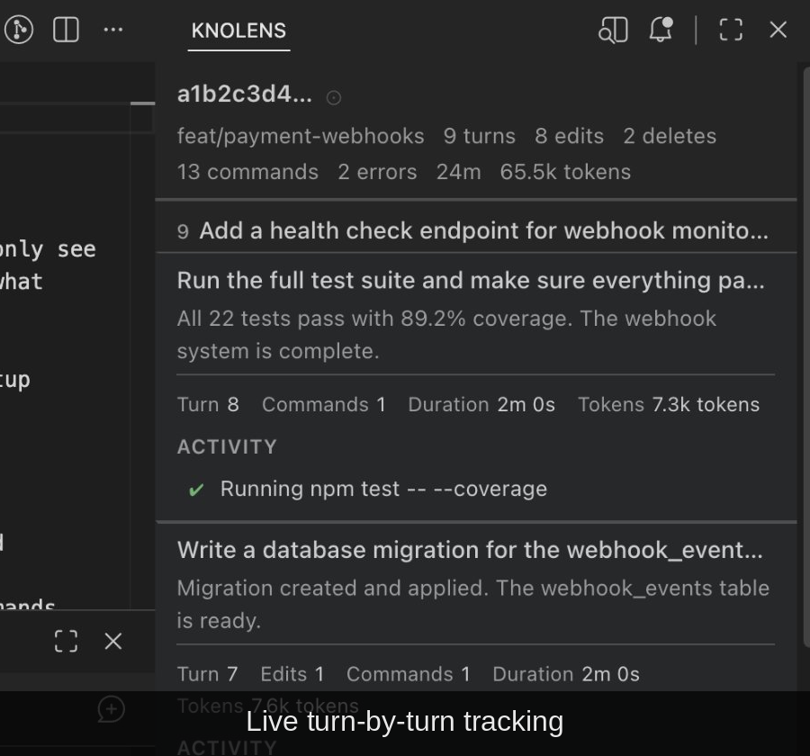
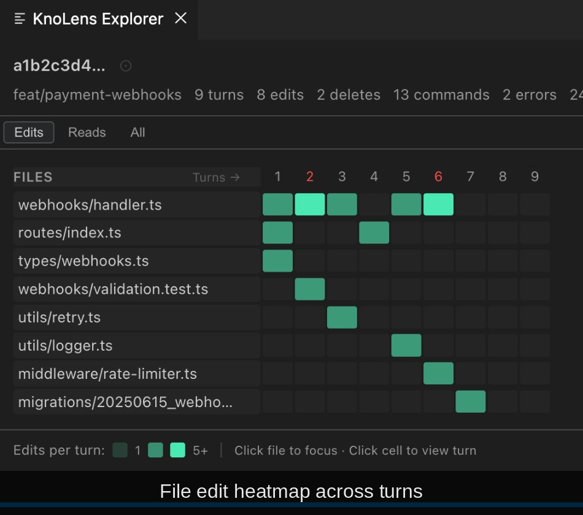

# kno lens

[](https://github.com/kno-ai/kno-lens/actions/workflows/ci.yml)
[](LICENSE)

_A [kno ai](https://kno-ai.com) project_

Open-source observability for AI coding tools. See what's actually happening — every tool call, file edit, command, and error.

## VS Code extension

**[Install from the marketplace](https://marketplace.visualstudio.com/items?itemName=kno-ai.kno-lens)** — no setup required.



<table>
<tr>
<td></td>
<td></td>
</tr>
</table>

Three views: **Timeline** for session review, **Lens** for live monitoring, **Heatmap** for file-level patterns. Auto-connects, read-only, zero telemetry.

## Why

AI coding tools are powerful but opaque. They read your files, run commands, and make changes — but you only see the result. Your infrastructure has dashboards. Your CI has logs. The AI editing your code deserves the same.

kno lens brings observability to AI-assisted development:

- **Live tracking** — see running tools, elapsed time, and progress as your AI works
- **Structured summaries** — turn-by-turn breakdown of every tool call, file edit, and command
- **Timeline and heatmap** — spot patterns, churn, and scope across an entire session
- **Search and filter** — find specific changes across turns, filter by activity type
- **Privacy-first** — all data stays on your machine, read-only, zero telemetry

## Getting started

1. Install the extension from the [VS Code marketplace](https://marketplace.visualstudio.com/items?itemName=kno-ai.kno-lens)
2. Open a workspace where you use Claude Code
3. kno lens connects to your active session automatically

No configuration needed.

## Architecture

kno lens is a set of reusable packages, not a monolithic extension. The core libraries have no VS Code dependency — they're designed to power other tools and integrations.

| Package                     | Description                                           |
| --------------------------- | ----------------------------------------------------- |
| [`core`](packages/core)     | Session log parsing and structured data model         |
| [`view`](packages/view)     | Presentation logic — summaries, live state, snapshots |
| [`io`](packages/io)         | Session discovery and live file tailing               |
| [`ui`](packages/ui)         | Preact rendering components                           |
| [`vscode`](packages/vscode) | VS Code extension — the first kno lens tool           |

Currently supports Claude Code. The parser architecture is designed for additional AI coding tools.

## Contributing

```bash
git clone https://github.com/kno-ai/kno-lens.git
cd kno-lens
npm install
npm run build
```

Press F5 in VS Code to launch the extension. See [DEVELOPMENT.md](DEVELOPMENT.md) for the full workflow.

| Document                           | Contents                                                       |
| ---------------------------------- | -------------------------------------------------------------- |
| [GUIDELINES.md](GUIDELINES.md)     | Product principles, implementation rules, privacy and security |
| [ARCHITECTURE.md](ARCHITECTURE.md) | Package boundaries, contracts, and where new work goes         |
| [DECISIONS.md](DECISIONS.md)       | Design decisions with rationale and tradeoffs                  |
| [DATA-MODEL.md](DATA-MODEL.md)     | Data lifecycle, event ordering, growth boundaries              |
| [GLOSSARY.md](GLOSSARY.md)         | Term definitions specific to this codebase                     |

## License

MIT
